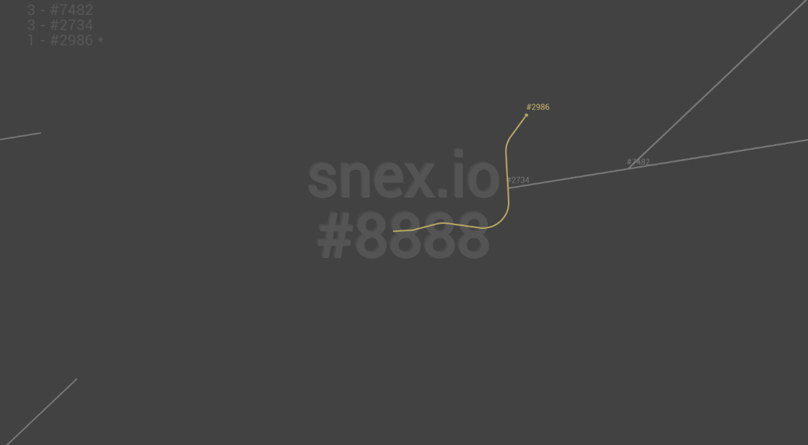

[](https://lgtm.com/projects/g/Klemek/snex.io/context:javascript)
[](https://lgtm.com/projects/g/Klemek/snex.io/alerts/)

# snex.io

it's a game


first thing :
```
npm install
```

then to launch :
```
npm start
```
it's now listening on *:3001


